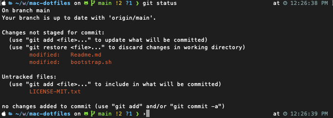

# Dennis' dotfiles


## Installation

**Warning:** If you want to give these dotfiles a try, you should first fork this repository, review the code, and remove things you don’t want or need. Don’t blindly use my settings unless you know what that entails. Use at your own risk!

### Prerequisites

Before proceeding, ensure your terminal application has full disk access. This is necessary for some scripts to function correctly, as they may need to read or write to protected areas of your disk.

To grant full disk access to your terminal:

1. Open System Preferences.
2. Navigate to Security & Privacy > Privacy tab.
3. Scroll down and select "Full Disk Access" from the list on the left.
4. Click the lock icon at the bottom left to make changes (you may need to enter your administrator password).
5. Click the "+" button, find your terminal application (e.g., Terminal, iTerm), and add it.
6. Close System Preferences and restart your terminal application for the changes to take effect.

After ensuring your terminal has full disk access, you can proceed with the installation steps below.

```
xcode-select --install
```
This command installs the Xcode Command Line Tools, which are required for some of the scripts and tools used in these dotfiles. It includes compilers like gcc and tools like git, which are necessary for the installation and management of many other tools and applications.


### Using Git and the bootstrap script

You can clone the repository wherever you want. (I like to keep it in `~/workspace/mac-dotfiles`.) The bootstrapper script will pull in the latest version and copy the files to your home folder.

```bash
git clone https://github.com/dennischen0/mac-dotfiles.git 
cd mac-dotfiles 
chmod +x bootstrap.sh
./bootstrap.sh
```

To update, `cd` into your local `dotfiles` repository and then:

```bash
source bootstrap.sh
```

Alternatively, to update while avoiding the confirmation prompt:

```bash
set -- -f; source bootstrap.sh
```

## Author

|  |
|---|
| [Dennis Chen](https://dennischen.com/) |

## Thanks to…

* [Mathias Bynens](http://benalman.com/) and his [dotfiles repository](https://github.com/mathiasbynens/dotfiles)